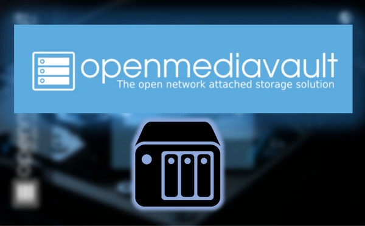
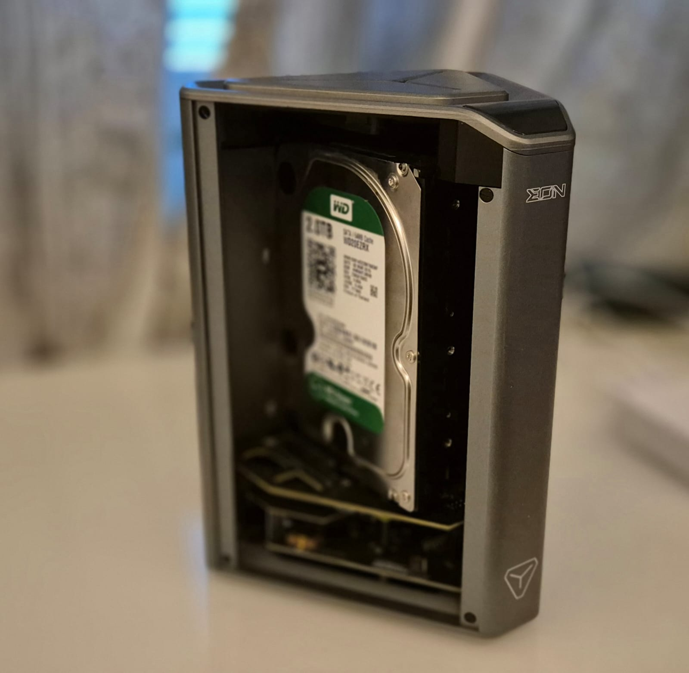

# OpenMediaVault Installation on Raspberry Pi Bullseye 64-bit Lite

<div align="center">
  
</div>


## Introduction

OpenMediaVault (OMV) is a powerful, open-source network-attached storage (NAS) solution designed for home and small office use. This guide will walk you through the steps required to install OpenMediaVault on a Raspberry Pi running the Bullseye 64-bit Lite operating system.

## Requirements



- Raspberry Pi 3, 4, or 400
- MicroSD card with Raspberry Pi OS Bullseye 64-bit Lite pre-installed
- SSH access to the Raspberry Pi
- Internet connection for the Raspberry Pi
- Rasberry Pi Case that support External/Internal HDD or SSD example Argon EON

## Steps

### 1. Connect to the Raspberry Pi

1. **SSH into your Raspberry Pi:**
   - Open a terminal on your computer.
   - Connect to your Raspberry Pi using SSH. Replace `<your_raspberry_pi_ip_address>` with the actual IP address of your Raspberry Pi.
     ```sh
     ssh pi@<your_raspberry_pi_ip_address>
     ```

2. **Update the System:**
   - Update the package lists and upgrade all packages.
     ```sh
     sudo apt update
     sudo apt upgrade -y
     ```

### 2. Install OpenMediaVault

1. **Install Required Packages:**
   - Run the following command to install OpenMediaVault:
     ```sh
     wget -O - https://raw.githubusercontent.com/AbedDX/Homelab/main/Scripts/install_OMV.sh | sudo bash
     ```

2. **Optional: Install Argon Eon Display Features:**
   - If you have an Argon Eon case, you can enable its display features by running:
     ```sh
     wget -O - https://raw.githubusercontent.com/AbedDX/Homelab/main/Scripts/install_OMV_ArgonEon.sh | sudo bash
     ```

3. **Reboot the Raspberry Pi:**
   ```sh
   sudo reboot

## 3. Initial Configuration of OpenMediaVault

### Access the Web Interface:

- Open a web browser and navigate to `http://<your_raspberry_pi_ip_address>`.
- Log in with the default credentials: `admin` / `openmediavault`.

### Change Default Password:

- Go to **General Settings** > **Web Administrator Password** and change the password.

### Configure Storage:

- Add and configure your storage devices through the **Storage** menu.

### Set Up Shared Folders and Services:

- Create shared folders and configure the necessary services (SMB/CIFS, FTP, etc.) under the **Services** menu.

## 4. Advanced Configuration (Optional)

### Network Configuration:

- Configure a static IP address and network settings under **System** > **Network**.

### Update Management:

- Check for updates and install them via the **Update Management** section.

### User Management:

- Add users and manage permissions in the **Access Rights Management** section.

## Troubleshooting

### Cannot Access Web Interface:

- Ensure the Raspberry Pi is connected to the network.
- Verify the IP address and check if the web interface port (default 80) is open.

### Permission Issues:

- Check and adjust permissions for shared folders and services under **Access Rights Management**.

## Conclusion

By following this guide, you should have a fully functional OpenMediaVault NAS running on your Raspberry Pi with Bullseye 64-bit Lite. OpenMediaVault provides a robust and flexible solution for managing your storage needs.

For further customization and plugin installations, refer to the [OpenMediaVault documentation](https://openmediavault.org/docs/) and community forums.
