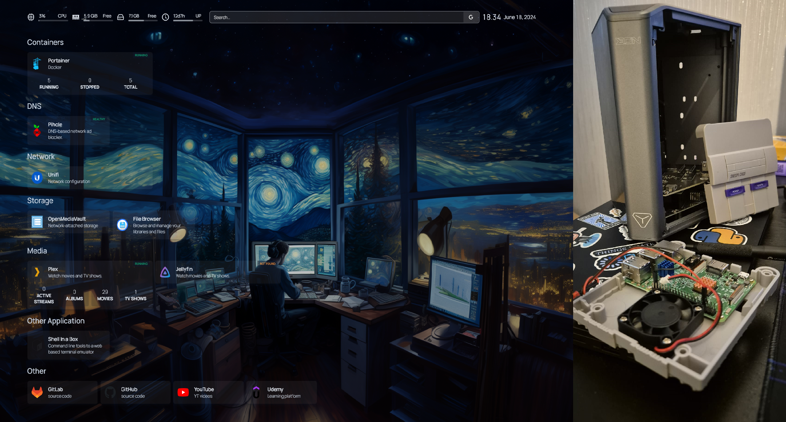

# Homelab - Docker Based Home Server

Welcome to the Homelab, This project aims to set up a homelab using a Raspberry Pi. It includes various services and applications that enhance the functionality and management of the network and media.

## Prerequisites

To get started, ensure you have the following hardware components ready:

- [Raspberry Pi 4]()
- [Micro SD Card]()
- [Heat Sink]()
- [Power Supply]()
- [Rpi4 Case With Fan]()
- [Micro HDMI to HDMI Cable]() (Optinal)
- [External/Internal HDD or SSD]() (Optional)

## Installing Operating System

We recommend using [Raspberry Pi Imager](https://www.raspberrypi.com/software/) to install the operating system on your SD card. Raspberry Pi Imager supports Windows, macOS, and Linux.

### Using Raspberry Pi Imager

1. Download and install Raspberry Pi Imager on your computer.

2. Insert your SD card into an SD card reader connected to your computer.

3. Open Raspberry Pi Imager, select "Raspberry Pi OS Lite (64bit)" from the list.

4. Choose the SD card you want to write the image to.

5. Click on the "Advanced Options" menu to set hostname (`raspberrypi.local`), enable SSH (password authentication), configure WiFi (optional), and configure the user and also localhostname can be.

6. Review your settings and click "Write" to start writing the image to the SD card.

## Post OS Installation

Insert the SD card into your Raspberry Pi 4, assemble the components, and connect to your network via Ethernet (recommended) or WiFi.

SSH into your Raspberry Pi using `ssh pi@raspberrypi.local` or the corresponding IP address provided by your router/DHCP server.

Update and upgrade your Raspberry Pi:

```bash
sudo apt update && sudo apt upgrade -y
```

### Installation of Docker and Portainer

To install Docker and Portainer, run the following command:

```bash
wget -qO- https://raw.githubusercontent.com/AbedDX/Homelab/main/Scripts/install_docker_portainer.sh | bash
```

After installation, reboot your Raspberry Pi for changes to take effect:

```bash
sudo reboot
```

### Accessing Portainer

1. Open a web browser and navigate to `http://raspberry_pi_ip:9000`.

2. Log in to Portainer.

3. Navigate to "App Templates" and deploy your desired applications.

---

List of all Documents used within this project.

---

| File Name | Description |
| --------- | ----------- |
|[Openmediavault.md]()|Install and setup instructions for OpenMediaVault network attached storage (NAS)|
|[Homepage.md]()|Install and setup instructions for Homapage Dashboard.|
|[nginx_proxy_manager.md]()|Install and setup instructions for Nginx Proxy Manager (NPM)|
|[pi-hole.md]()|Install and Setup Pi-Hole for Network-Wide Ad Block|
|[unbound.md]()|Install and Setup Unbound , a validating, recursive, caching DNS resolver.|
|[rpimonitoring.md]()|Install and Setup Raspberry Pi & Docker Monitoring, A user-friendly way to monitor the performance of your Raspberry Pi|
|[jellyfin.md]()|Install and Setup Jellyfin, A Software to provide media from a dedicated server to end-user devices via multiple apps|
[Plex.md]()| Install and Setup Plex, A Software application that allows you to organize and stream your collection of movies, TV shows, music, and photos, from a central location. |
|[filebrowser.md]()|Install and Setup Filebrowser, A file managing interface within a specified directory and it can be used to upload, delete, preview, rename and edit your files|


### Conclusion
This homelab setup on a Raspberry Pi can be continuously expanded by adding new applications as required. Follow the steps above to ensure smooth integration and operation of each new service.

# Homelab
